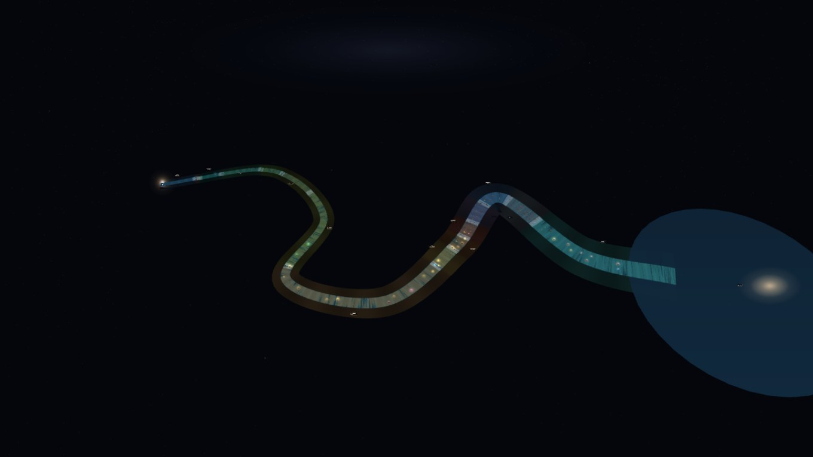

# 🏞️ 滚滚长河 · 138亿年奔流史

一个**零依赖、开箱即用**的交互式历史科普演示：把宇宙大爆炸以来的 138 亿年铺成**一条奔流的大河**——源头是宇宙大爆炸，入海口是今天。河水按纪元染色，纪元交界处跌水瀑布，历史事件是一盏盏漂浮的河灯。双击 `index.html` 即可在浏览器中运行（无需服务器、无需联网——three.js 已本地化，水面/辉光/标签全部程序生成）。



## ✨ 核心创意

### 一条只向前的大河
- **源头 = 大爆炸，入海口 = 今天**：时间沿蜿蜒河道向下游流淌，只向前、不回头、不成圈。
- **航拍画卷视角**：高空斜俯瞰整段历史，事件一目了然；拖拽环绕、滚轮缩放，可贴近水面也可看全河。
- **深时用对数河道**：同样长的一段河，上游装 1 亿年，下游只装 10 年——文明史确实挤在大河的最后一湾。

### 纪元 = 彩色河段 + 跌水瀑布 + 石拱门
- 河水按 **14 个纪元染色**，交界处河床级级下降：垂直水幕（条纹奔流）+ 白浪带 + 浪花构成滚滚跌水，**石拱门**横跨河面并悬挂纪元名。
- **岸边时代图腾**：每个纪元的内岸立着大号形象——恐龙时代的 🦕、古生代的 🐟、农业文明的 🌾、大航海的 ⛵、工业时代的 🏭……一眼识别所处时代（点击图腾可飞往该河段）。
- 左侧**纪元年表**点击直接飞往该河段，航行中自动高亮当前所在纪元。

### 事件 = 河灯
- **550+ 盏河灯**漂浮在水面对应年代的位置：灯的位置 = 年代，灯色 = 类别（宇宙/地球/生命/文明/科学/艺术），亮灯 = 事件发生。
- 河灯随水波起伏、灯焰闪烁，水面映出彩色光斑。

### 🌍 文明支流体系（四河归海）
- 主河道承载自然史与共同史；自各大文明登场起，**四条支流**平行奔流、同归入海：
  - 🐉 **中国支流**（48 盏）：二里头、甲骨文、孔子、秦统一、敦煌、盛唐、郑和……
  - 🏛️ **希腊·罗马支流**（18 盏）：特洛伊、雅典民主、亚历山大、布匿战争、凯撒、庞贝、斗兽场……
  - 🕌 **阿拉伯·伊斯兰支流**（7 盏）：希吉拉、巴格达建都、智慧宫百年翻译、花拉子米……
  - 🕉️ **印度支流**（6 盏）：印度河文明、佛陀、阿育王、泰姬陵、民族觉醒……
- 各支流专属配色、名牌、首尾图腾与里程碑拱门；丘陵在全部走廊自动让位。
- 档案卡带文明徽章（🏮 中国 / 🏛️ 希腊·罗马 / 🕌 阿拉伯·伊斯兰 / 🕉️ 印度）；问答「世界」范围含全部支流事件。
- 数据约定：条目加 `cn: 1` 进中国支流；加 `cult: "grc" / "isl" / "ind"` 进对应文明支流。

### ⏸ 暂停与漫游（时间凝固）
- **空格 / ⏸ 按钮**：时间凝固——水流、波浪、河灯起伏与飞览全部暂停，再按继续。
- **拖动顶部进度条**：像视频一样任意跳转航程（自动进入暂停态）。
- **← → 方向键**：沿河小幅后退/前进（Shift 大步）。

### 🎬 飞览全程（打开即播）
- 页面加载后，航拍镜头从源头**自动飞到入海口**（约 45 秒），年份计数器同步狂奔，"河灯 62/124"实时点亮计数。
- 飞览中**拖拽画面即可随时接管**镜头，自由沿岸浏览。

### 🎙 语音导览 / 🎥 录制 / 🔗 分享定位
- **🎙 导览**：开启后飞览自动播报进入的纪元（名称+年代+简介），单击河灯播报事件档案——Web Speech 合成，离线可用。
- **🎥 录制**：一键录制飞览全程为 webm 视频（30fps），到达入海口后自动停止并下载；录制中右上角亮 REC 指示灯。
- **🔗 分享定位**：单击任何河灯后，地址栏链接即携带定位（如 `#m=civ&e=apollo`）；发给他人打开，直接落在"文明时代"河段的阿波罗登月河灯前并自动打开档案卡。

### 🏆 问答模式 / 🌗 昼夜 / 🔊 水声
- **🏆 问答**：寻宝模式——按线索（类别、所属纪元、年代）找到目标河灯；点对了连对+1，点错了会提示"这是「××」，再找找"；可飞往河段提示或跳过揭示答案。答题时类别筛选自动全开。
- **问答范围**：🌏 全部 / 🐉 中国 / 🗺️ 世界 一键切换题库。
- **🌗 昼夜**：一键切换 **☀️ 白天**（亮天空、日光下的纪元色阶两岸、青蓝河水平沙色）与 **🌙 星夜**（星空银河、河灯夜航）两种氛围。
- **🔊 水声**：Web Audio 实时合成的环境流水声（布朗噪声+低通+缓慢起伏），时间凝固时自动减弱。

## 📚 科普内容

- **约 120 个历史事件**，分六大类：🌌 宇宙 / 🌍 地球 / 🧬 生命 / 🏛️ 文明 / 🔬 科学 / 🎨 艺术——从大爆炸、有性繁殖、寒武纪大爆发、恐龙灭绝，到都江堰、四大发明、郑和下西洋、登月、基因剪刀与黑洞照片。
- **事件档案卡（图文并茂）**：顶部大图区显示类别/纪元图腾；**联网时自动抓取维基百科配图**——中文搜索 → 中文词条 → 英文词条 → 英文搜索四级回退（8 秒超时保护，结果本地缓存），离线优雅降级为动态图腾插画。另有年代、简介、趣味知识、宇宙日历与同时代事件。
- **🎬 飞览可续飞**：飞览途中点击河灯、拖拽画面或拖动进度条都会打断飞览，但随时点「▶ 从此处继续 (xx%)」即从原处接着飞；关闭档案卡也会自动续飞。
  - **🌌 宇宙日历**（卡尔·萨根）：把 138 亿年压缩成一年后该事件发生的时刻（如恐龙灭绝 = 12月30日 06:06，全部文字史 = 最后 12 秒）；
  - **⏳ 同时代的星空**：河道上航程相邻的其他河灯，一键飞往（发现"阿波罗登月"与"互联网诞生"同年出发）。
- **纪元卡**：时间范围、简介、**📖 深度解读**（16 个深时纪元各约 200 字：时代特征、关键转折与我们如何得知）与该河段全部河灯。
- **🌠 氛围动画**：星夜偶有流星划落，白天雁群沿河飞行。
- **📖 科普课堂**：长河隐喻、深时与对数河道、宇宙日历对照表。
- **🌏 中外大事对照表**：科普课堂内置同年代"世界 vs 中国"大事速览。
- **🧭 探索进度 + 成就徽章**：单击过的河灯自动计数，跨过 10/25/50/100/200/400/551 里程碑时弹出成就徽章（初涉长河→燃尽长河·全图鉴），进度本地保存。
- **🌟 今日之灯**：按日期轮换的每日推荐事件，一键飞往。
- **事件配图自定义**：数据条目可加 `wiki: "词条名"` 字段指定更准的配图词条。
- **🗺️ 小地图**：右下角实时显示双河走向（纪元彩线）、全部河灯微点、镜头金点与视线落点，点击直接跳转。
- **🏷️ 标签防重叠**：密集河段自动只显示最近的 26 个河灯名（屏幕网格去重），-readable 不糊脸。
- **📈 自适应画质**：帧率过低时自动逐级降低渲染分辨率，流畅后自动恢复。
- **支流首尾图腾**：🐉 开源、🏮 入海；沿途**朝代金拱门**（秦汉 / 隋唐 / 宋元 / 明清）标记中华史里程碑。
- **悬停共鸣**：悬停任意河灯，同纪元的其他河灯会轻轻应和增亮——直观感受"同一时代的世界"。
- **设置自动记忆**：昼夜/导览/标签/河道刻度/问答最佳纪录本地保存，下次打开自动恢复。
- **底部小知识**：每 9 秒轮播一条趣闻（30 条轮换）。
- **📜 时代金句 / ❓ 常见疑问**：科普课堂新增 9 条时间主题名言与 6 个高频疑问解答（为什么对数刻度？恐龙和三叶虫谁更远？）。

## 🕹 交互控制

| 操作 | 功能 |
|---|---|
| 拖拽 / 滚轮 / 右键拖拽 | 环绕 / 缩放 / 平移（航拍视角） |
| ⏸ 暂停 / 空格 | 时间凝固：水流、波浪、河灯与飞览全部暂停 |
| 拖动顶部进度条 | 像视频一样任意跳转航程 |
| ← →（+Shift） | 沿河小幅后退 / 前进 |
| 🎬 飞览全程 | 自动飞览；中断后变为「▶ 从此处继续 (xx%)」，点击续飞 |
| 🎙 导览 | 语音解说开关：飞览报纪元、单击河灯报事件 |
| 🔊 水声 | 环境流水声开关（暂停自动减弱） |
| ⛶ 全屏 | 全屏显示 / 退出 |
| 🗺 小地图 | 右下角实时双河位置；点击任意处直接跳转该河段 |
| 🎓 教学路线 | 三条导学路线逐站讲解（手动/自动播放） |
| 📚 图鉴 | 按时代分卷浏览全部事件，点击直达河灯 |
| 🖼️ 画面 | 一键把当前画面存为 PNG（带年份水印） |
| 🌗 星夜/白天 | 切换两种渲染氛围 |
| 🏆 问答 | 寻宝模式：找河灯答题，连对计分 |
| 🎥 录制 | 录制飞览全程 → webm 自动下载 |
| 🗺 全河鸟瞰 | 升到高空看整条大河的蜿蜒全貌 |
| 飞览中拖拽画面 | 随时接管镜头 |
| 单击河灯 | **原地弹出**事件档案卡（不移动镜头；含宇宙日历与同时代事件） |
| 单击时代图腾 / 拱门标签 / 年表条目 | 飞往该纪元河段 + 纪元卡 |
| 图例点击 | 按类别筛选河灯 |
| 搜索框 | 关键词查找，回车直接飞过去（非命中河灯淡出） |
| 标签开关 | 纪元/河灯标签显隐（河灯标签飞近后自动出现） |

- **📽️ 纪录片模式**：一键放映——自动飞览 + 随纪元切换的字幕条（纪元名/年代/本河段大事）+ 语音解说，播完自动谢幕。
- **🎓 教学路线**：三条内置导学路线（🐉 中华文明五千年 11 站 / 🔬 科学的历程 12 站 / 🌌 宇宙·地球·生命 12 站）——逐站自动飞往并讲解，支持手动翻站与 9 秒自动播放，课堂即用。
- **⏱️ 进度条实时预览**：悬停/拖动顶部进度条时，气泡即时显示该航程的年份与最近河灯，松手才跳转。
- **📱 PWA 应用**：通过 https 服务访问时，可在浏览器菜单「安装 / 添加到主屏幕」——离线可玩、全屏运行（Service Worker 缓存，HTML 网络优先保证更新及时）。
- **图鉴搜索**：图鉴弹窗顶部输入关键词即时过滤（自动展开命中卷）。

## 🚀 运行方式

直接**双击 `index.html`**（Chrome / Edge / Firefox 均可）。如需局域网分享：

```bash
python -m http.server 8080
# 访问 http://localhost:8080
```

## 📁 目录结构

```
time-rings/
├── index.html          页面骨架与弹窗
├── css/style.css       深空玻璃拟态界面样式
├── js/
│   ├── lib/three.min.js      three.js r130（本地化，复用自 sun/ 项目）
│   ├── lib/OrbitControls.js  轨道控制器
│   ├── data.js               纪元、约 100 条事件、小知识与课堂文案
│   ├── textures.js           程序化水面 / 辉光 / 文字标签贴图
│   ├── scene.js              三维场景：蜿蜒河道、纪元跌水、河灯、飞览
│   └── app.js                界面：档案卡、纪元年表、筛选、搜索、弹窗
├── docs/               设计简图与预览截图
│   ├── design-mockup.html    可交互设计简图（开发前的确认稿）
│   └── river-*.jpg           预览截图
```

## 🔍 数据体检

手改 `js/data.js` 后运行 `node check.js`：自动校验 id 唯一性、必填字段、cat/imp/ago 合法性、标题重复、cn 标记、教学路线 id 有效性等（错误退出码 1，警告不影响运行）。

## 📐 数据口径

- 年代取学界通行近似值；部分事件（生命起源的确切时间、二里头与夏的对应等）学界仍在研究，存在区间或争议，仅供科普参考。
- 河灯在河道上的位置由时间决定：`航程 = f(距今)`（深时对数 / 其余线性）；左右岸由事件序号交替，避免重叠。
- 宇宙日历按线性换算：每宇宙 1 天 ≈ 3781 万年，每宇宙 1 秒 ≈ 438 年。

## 💡 设计灵感

"子在川上曰：逝者如斯夫"——以长河喻时间是中国最古老的哲思之一；河灯（放灯纪念）赋予了"事件"以纪念的意象。深时与对数刻度的呈现方式致敬卡尔·萨根《宇宙》与《Powers of Ten》。

## 🛠 技术要点

- three.js r130 + OrbitControls，单页零构建、零外部请求；
- 河道为 CatmullRom 样条曲线，河面/两岸/跌水均为沿样条的参数化带状网格；
- 水面为 **GPU 自定义着色器**：多层噪声流纹视差滚动、碎金闪光、波峰微光、岸缘白沫（噪声破碎）、顶点正弦波浪，全部着色器内计算；纪元色以顶点色微染烘入；
- 跌水 = 垂直水幕（条纹纹理向下奔流）+ 白浪带 + 浪花粒子，河床逐纪元阶梯下降；纪元石拱门（半圆环面）横跨河面并悬挂纪元名；
- 顺流流光粒子：220 颗光点沿河道推进、入海口重生，强化奔流感；
- 两岸 = 内岸缓坡 + 外围丘陵两级地形（按纪元顶点着色），260 棵实例化林木、漂移流云点缀；
- 河灯 = 灯船 + 辉光 + 焰心 + 水面光斑，随水波起伏、按相位闪烁；
- 对数/线性双刻度映射 `progress(ago)`，飞览即该映射的逆演（年份读数由航程反解）；
- 全局"时间凝固"暂停：一处 `paused` 开关统一冻结着色器时间/水流/河灯/飞览；
- 空格按住 + 左键拖拽 = 平移画面（抓取视图，飞览中可用；轻点空格或 P = 暂停）；
- 问答判定在场景层拦截河灯点击（目标比对：答对庆祝飞近、答错红灯闪烁提示）；
- 昼夜切换 = 重设清屏/雾色 + 灯光强度 + 星空显隐 + 地形/水体/辉光按日/夜参数重建；
- 环境水声由 Web Audio 实时合成（布朗噪声→低通滤波→LFO 起伏，首尾校正无缝循环）；
- 语音导览基于 Web Speech API（自动挑选中文声源）；录制基于 canvas.captureStream + MediaRecorder（VP9/webm）；分享定位用 URL hash（`#m=模式&e=事件`）+ replaceState，无后端；
- rAF 被浏览器节流（后台标签页）时自动以低频定时器兜底推进动画与渲染。
